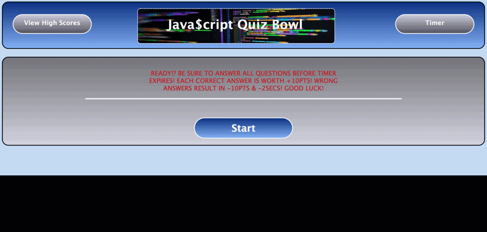
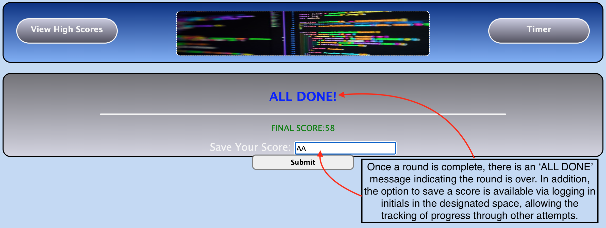
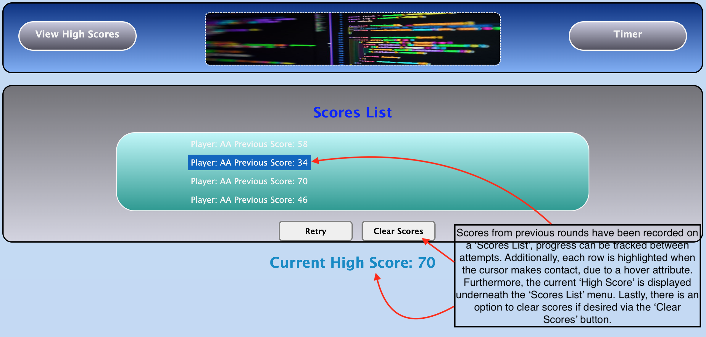
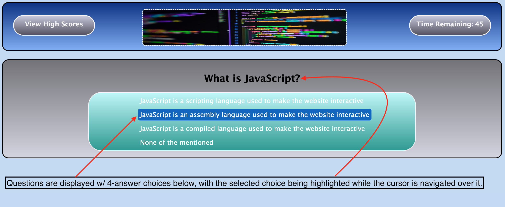
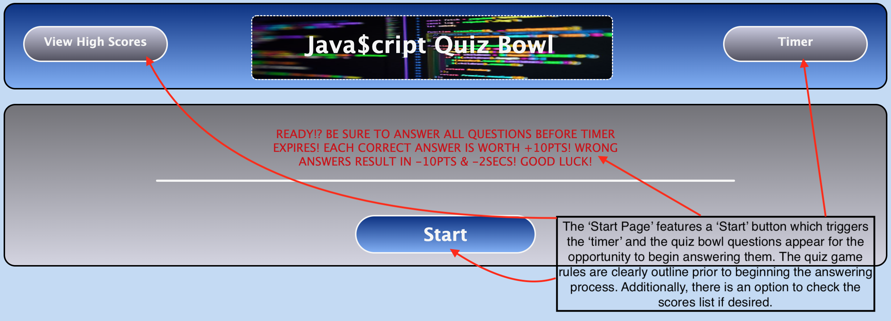
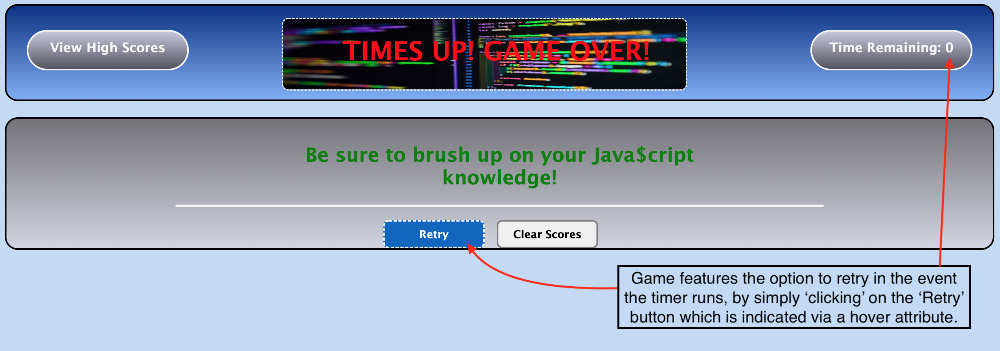

# Java$cript Quiz Bowl 

## APPLICATION OVERVIEW:

The Java$cript Quiz Bowl application features a user interactive game measuring aptitude against time via the classic quiz game setup with a technological twist. This application allows users to answer quiz formatted questions while the clock is running and a score tracking system is in play. Using a combination of the latest Javascript code along with HTML and CSS, the application is functional and fun at the same time. 

The user has the opportunity to answer javascript related questions in a certain amount of time, tracked by a visible timer. Each correct answer will increase the user's total score, however each wrong answer will reduce both the score and the time. Additionally, the user can log their final score using initials and retry the game as many times as they would like. Lastly, the menu features a 'Scores List' where the user is able to track their progress through each successive round of gameplay. 

Overall, this app will run in the browser and will feature dynamically updated HTML and CSS powered by JavaScript while having mobile device capability.

Located below there is an acceptance criteria outlined to define the standards and expectations of this application:


## ACCEPTANCE CRITERIA:

```
GIVEN I am taking a code quiz
WHEN I click the start button
THEN a timer starts and I am presented with a question
WHEN I answer a question
THEN I am presented with another question
WHEN I answer a question incorrectly
THEN time is subtracted from the clock
WHEN all questions are answered or the timer reaches 0
THEN the game is over
WHEN the game is over
THEN I can save my initials and my score
```


## MOCK-UP:


The following gif and images demonstrate the application's appearance and functionality:





### Saving Score(s) Using Input/Form:





### Scores List:





### Questions & Answers Display:





### Start Page:





### Game Over:





* Below are the links to both the live deployed webpage and GitHUB Repository URLs: (PLEASE FIND THE ANSWER KEY TO THE GAME QUIZ BELOW)

**Note:** ANSWER KEY: [0, 1, 0, 3, 3, 1, 1, 1, 0, 2, 1, 2, 3, 1, 3, 0, 1, 1]

### Depolyed Webpage URL:

* 

### GitHUB Repository URL:

* https://github.com/AASports89/jscript-quiz-bowl


Below is a evaluation criteria which will serve as a guideline when performing an evaluation of this application in terms of all the standard terms typically used during new application launches:


## EVAULUATION GUIDELINES:

### Technical Acceptance Criteria: 40%

* Satisfies all of the preceding acceptance criteria.

### Deployment: 32%

* Application deployed at live URL.

* Application loads with no errors.

* Application GitHub URL submitted.

* GitHub repository contains application code.

### Application Quality: 15%

* Application user experience is intuitive and easy to navigate.

* Application user interface style is clean and polished.

* Application resembles the mock-up functionality provided in the Challenge instructions.

### Repository Quality: 13%

* Repository has a unique name.

* Repository follows best practices for file structure and naming conventions.

* Repository follows best practices for class/id naming conventions, indentation, quality comments, etc.

* Repository contains multiple descriptive commit messages.

* Repository contains quality readme file with description, screenshot, and link to deployed application.

---